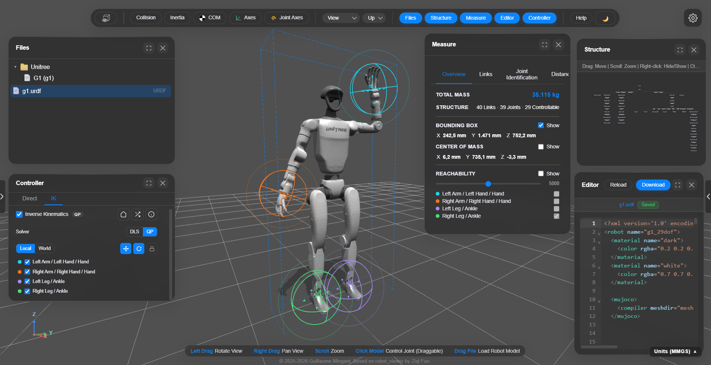

---

# Ermine Robot Viewer

Ermine (**E**nvironment for **R**obot **M**odel **IN**spection and **E**diting)

[](https://github.com/GuillaumeMINGANT/ERMINE-Robot_Viewer)
[](LICENSE)
[](https://github.com/GuillaumeMINGANT/ERMINE-Robot_Viewer)
[](https://github.com/GuillaumeMINGANT/ERMINE-Robot_Viewer)
[](https://threejs.org/)
[](https://vitejs.dev/)
[](https://guillaumemingant.github.io/ERMINE-Robot_Viewer/)

**Ermine Robot Viewer** is a browser-based workbench for inspecting, editing, debugging, exploring, and controlling robot description models across formats such as URDF, Xacro, MJCF, and USD. Built on top of [Three.js](https://threejs.org/), it runs entirely in the browser — no installation required. Load robots from file or browse a catalog of 80+ URDF models from 35+ brands.

This project is a fork of [robot_viewer](https://github.com/fan-ziqi/robot_viewer) by Ziqi Fan, with modifications and additional features by Guillaume Mingant.

**Live Demo** (All processing happens in your browser - your models never leave your device):

[](https://guillaumemingant.github.io/ERMINE-Robot_Viewer/)

## Key Features

### Format Support

- **URDF** — Unified Robot Description Format
- **Xacro** — ROS Xacro format with macro expansion and conditional logic
- **MJCF** — MuJoCo XML format
- **USD** — Universal Scene Description (partial support)

### Robot Catalog

Browse 80+ URDF models from 35+ brands organized in a two-level brand gallery with search and category filtering (arm, biped, humanoid, quadruped, hand, dual arm, mobile, wheeled, drone). Models load directly from a remote CDN — no download required.

### Forward / Inverse Kinematics

Drag IK gizmos to pose end-effectors in real time. The IK system includes:

- **Two solvers** — Damped Least-Squares (DLS) Jacobian pseudo-inverse and a QP-based task-space solver inspired by [PlaCo](https://github.com/Rhoban/placo)
- **Multi-tip whole-body IK** — automatic tip detection for humanoids (hands, feet, head) and serial arms, with per-tip enable/disable toggles
- **Humanoid kinematics analyzer** — topology and naming heuristics for automatic limb/joint classification (arms, legs, torso, head) supporting left/right detection and anatomical labeling
- **Joint-limit enforcement** — pre-locking at boundaries, null-space limit avoidance, and box-constrained QP for stable behavior at joint limits
- **Gizmo controls** — translate/rotate modes, local/world frame toggle, link locking to prevent direct articulation
- **Home / Random pose** — smooth animated transitions to zero or random joint configurations

### Reachability Point Clouds

Sample random joint configurations and visualize the workspace as per-tip colored point clouds (up to 10 000 samples per tip).

### Visualization Tools

- Visual and collision geometry rendering with transparency control
- Inertia tensors (Gazebo-style ellipsoids)
- Center of mass markers (per-link and global)
- Coordinate frames on links, joint axes visualization
- Bounding box display
- Shadows and lighting control
- World axes gizmo for orientation reference
- Dark / Light theme (persisted in localStorage)

### Measurement & Analysis

- Total robot weight from URDF inertial data
- Bounding box dimensions
- Per-link mass, inertia, and joint properties with sortable tables
- Limb-group breakdown using kinematic category analysis
- Joint-to-joint distance measurement with 3D visualization (X/Y/Z axis projections and total distance)
- Configurable units (radians/degrees, meters/mm, Nm/etc.)

### Interactive Controls

- Drag joints in real-time to adjust model poses
- Joint sliders with editable limits
- Angle display in radians or degrees
- MuJoCo physics simulation (start/pause/reset) for MJCF models

### Code Editor

Built-in CodeMirror editor with XML syntax highlighting, live preview, and reload/download actions.

### Scene Management

File tree and scene graph (model hierarchy) visualization with interactive selection and highlighting.

### Internationalization

English and Chinese (Simplified) with a settings-panel language picker.

## Getting Started

**Prerequisites:** [Node.js](https://nodejs.org/) 20+ and [pnpm](https://pnpm.io/installation) 9+ on your `PATH`. After changing PATH or installing Node, restart your terminal (or Cursor).

This project uses **pnpm**, but you can also use **npm** or **yarn**.

Clone the repository, install dependencies, and start the local dev server:

```bash
git clone https://github.com/GuillaumeMINGANT/ERMINE-Robot_Viewer.git
cd ERMINE-Robot_Viewer
pnpm install
```

Start the development server:
```bash
pnpm run dev
```

The app is then available at **http://localhost:3000** (Vite opens the browser automatically).

Build for production:

```bash
pnpm run build
```

Output will be in the `dist/` directory.


## GitHub Pages (live demo)

The live site must serve the **Vite build** in `dist/`, not the raw repo. If the page loads but nothing is clickable, open **View page source** — a broken deploy still has `src="/src/main.js"`; a correct deploy has `src="/ERMINE-Robot_Viewer/assets/js/..."`.

### One-time setup (pick **one** option)

**Option A — GitHub Actions (recommended)**

1. [Settings → Pages](https://github.com/GuillaumeMINGANT/ERMINE-Robot_Viewer/settings/pages) → **Build and deployment → Source** → **GitHub Actions**
2. Merge to `main` or run **Actions → Deploy to GitHub Pages → Run workflow**

**Option B — `gh-pages` branch**

1. Same Pages settings → **Deploy from a branch** → branch **`gh-pages`** → folder **`/ (root)`** (not `main`)
2. After the workflow runs, it updates `gh-pages` with the built `dist/` contents

Do **not** use **main** / **(root)** — that publishes unbuilt source and breaks the app.

### After deploy

Hard-refresh https://guillaumemingant.github.io/ERMINE-Robot_Viewer/ (Ctrl+F5).

## Contributing

We welcome contributions from the community! Whether you're fixing bugs, adding features, or improving documentation, your help is appreciated.

- **Bug Reports**: Open an [issue](https://github.com/GuillaumeMINGANT/ERMINE-Robot_Viewer/issues) with details
- **Feature Requests**: Discuss ideas in [Discussions](https://github.com/GuillaumeMINGANT/ERMINE-Robot_Viewer/discussions)
- **Pull Requests**: Submit PRs with clear descriptions and tests

## License

This project is licensed under the [Apache License 2.0](LICENSE).

Original work Copyright 2025 Ziqi Fan. Modifications and additions Copyright 2025-2026 Guillaume Mingant.

## Acknowledgements

Ermine Robot Viewer builds upon the excellent work of the open-source robotics community:

- **[robot_viewer](https://github.com/fan-ziqi/robot_viewer)** — The original project this fork is based on, by Ziqi Fan
- **[robot-explorer](https://github.com/ferrolho/robot-explorer)** — Interactive 3D robot viewer with IK, manipulability ellipsoids, and force polytopes; robot catalog model source
- **[PlaCo](https://github.com/Rhoban/placo)** — QP-based robot planning and control framework by Rhoban; the QP IK solver architecture is inspired by PlaCo's constrained task-space formulation
- **[urdf-loader](https://github.com/gkjohnson/urdf-loaders)** — Robust URDF loading for Three.js
- **[xacro-parser](https://github.com/gkjohnson/xacro-parser)** — ROS Xacro file format parser for JavaScript
- **[mujoco_wasm](https://github.com/zalo/mujoco_wasm)** — MuJoCo physics engine compiled to WebAssembly
- **[usd-viewer](https://github.com/needle-tools/usd-viewer)** — OpenUSD viewer with rich USDStage support
- **[mechaverse](https://github.com/jurmy24/mechaverse)** — Universal 3D viewer for robot models, providing valuable design inspiration

Special thanks to all the maintainers and contributors of these projects for their foundational work.

Parts of this project were developed with the assistance of [Cursor](https://cursor.sh).
